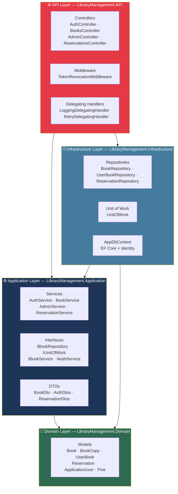
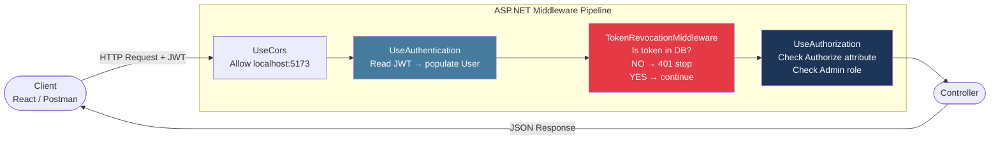
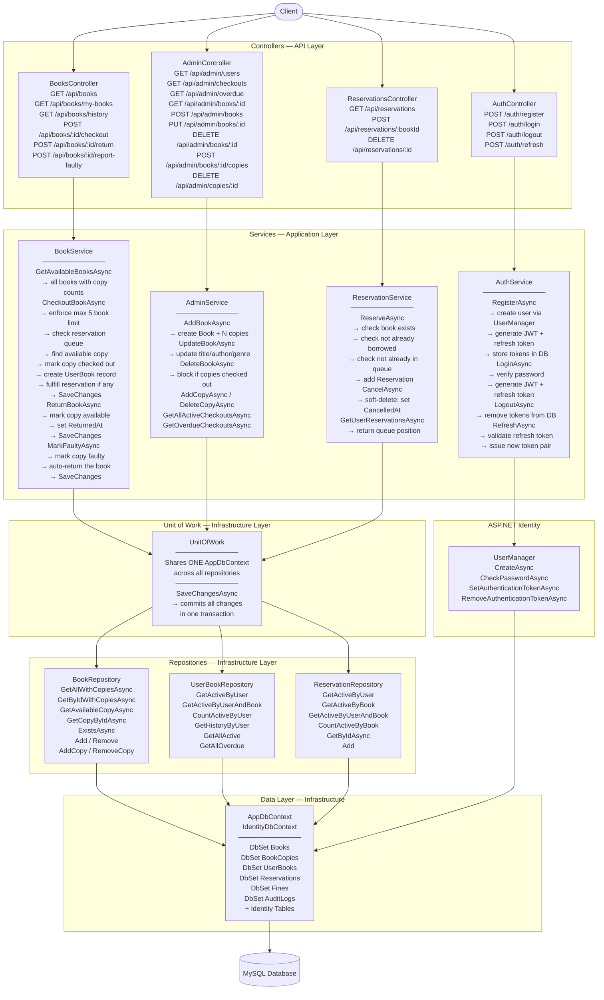
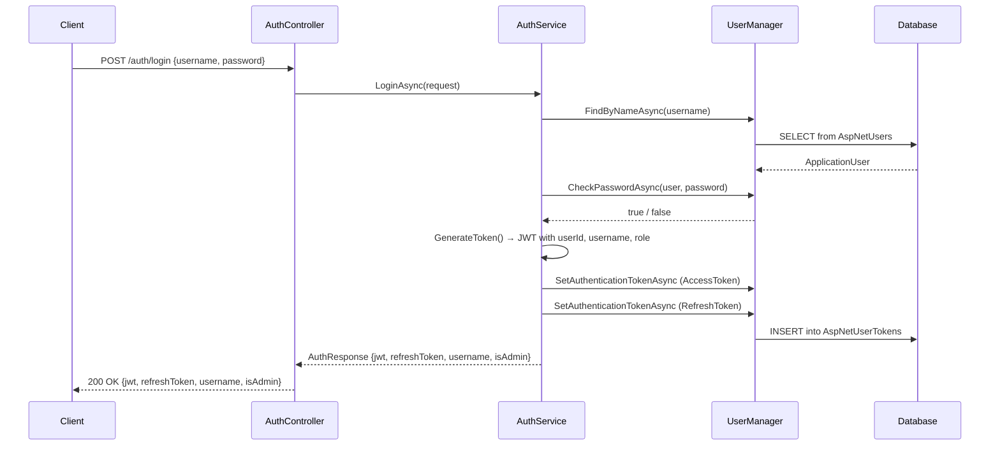
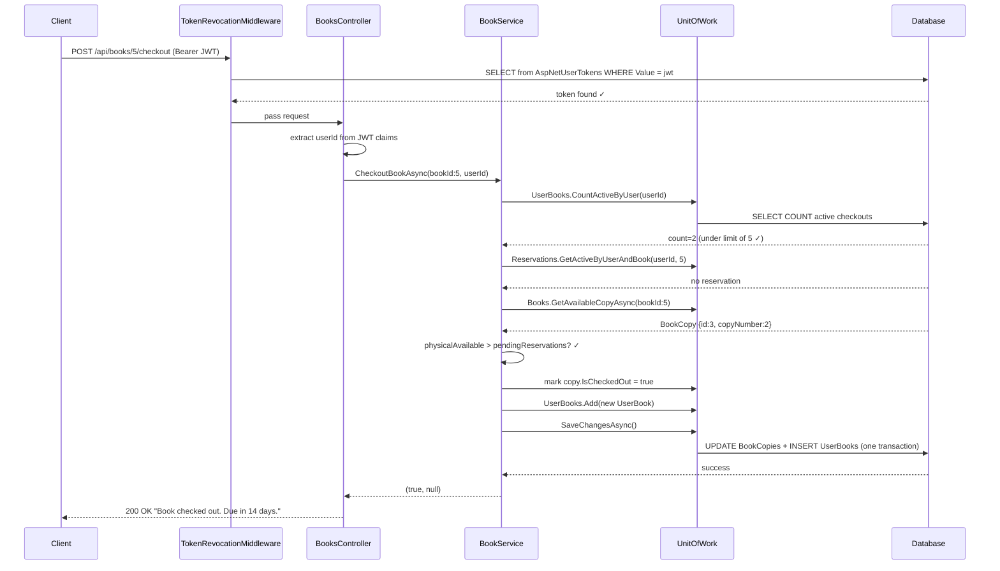
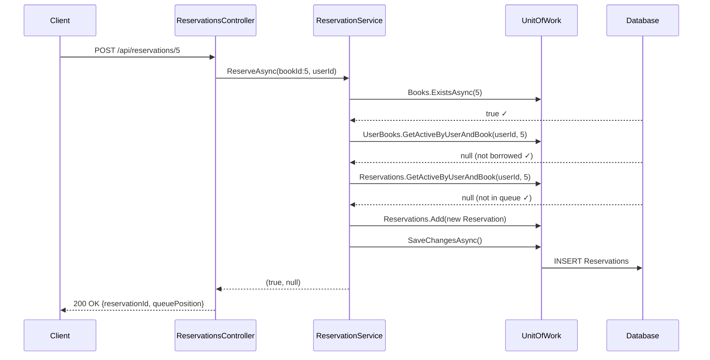
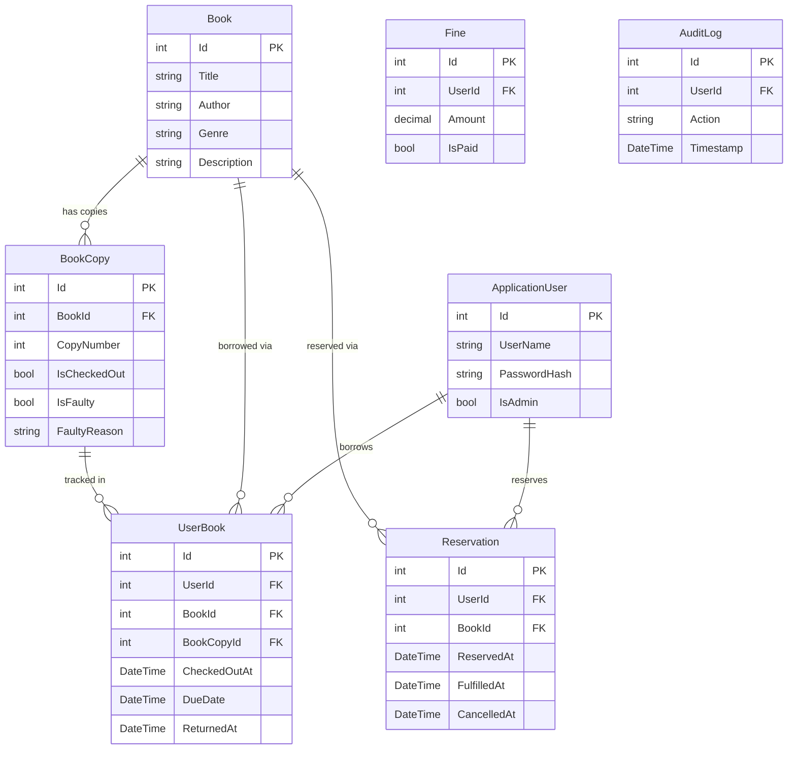

# Library Management System — Architecture & Workflow

---

## 1. Clean Architecture — Layer Overview

> **Key rule:** Dependencies point inward only. `Application` never knows EF exists. `Domain` knows nothing outside itself.

---

## 2. HTTP Request Pipeline

---

## 3. Full Application Workflow

---

## 4. Key Flows

### Login Flow

---

### Checkout Flow

---

### Reservation Flow

---

## 5. Database Schema

---

## 6. Pattern Map

| Pattern | Where |
|---|---|
| **Clean Architecture** | 4 separate projects: `Domain` → `Application` → `Infrastructure` → `API` |
| **Repository Pattern** | `IBookRepository` (Application) implemented by `BookRepository` (Infrastructure) |
| **Unit of Work** | `IUnitOfWork` / `UnitOfWork` — one shared `AppDbContext`, one `SaveChangesAsync()` |
| **DbContext** | `AppDbContext` extends `IdentityDbContext` — EF Core gateway to MySQL |
| **ASP.NET Identity** | `ApplicationUser : IdentityUser<int>` — handles users, passwords, tokens |
| **Middleware** | `TokenRevocationMiddleware` — blocks revoked JWTs before hitting controllers |
| **Delegating Handler** | `LoggingDelegatingHandler` + `RetryDelegatingHandler` — wraps outbound HTTP calls |
| **MVC** | Controllers (C) + Domain Models (M) + JSON responses (V) |
