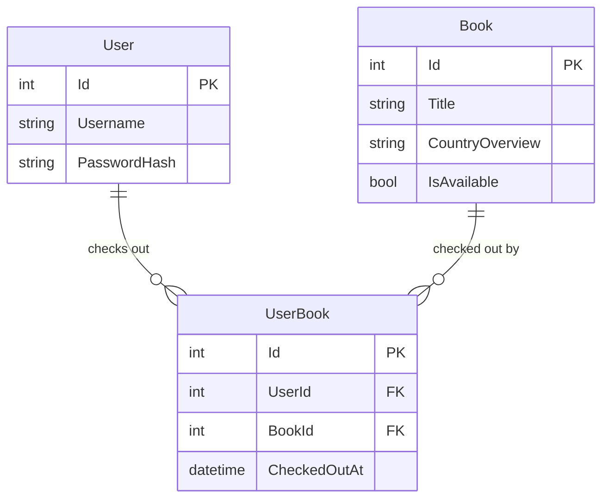

```mermaid
erDiagram
    User {
        int Id PK
        string Username
        string PasswordHash
    }

    Book {
        int Id PK
        string Title
        string CountryOverview
        bool IsAvailable
    }

    UserBook {
        int Id PK
        int UserId FK
        int BookId FK
        datetime CheckedOutAt
    }

    User ||--o{ UserBook : "checks out"
    Book ||--o{ UserBook : "checked out by"
```
