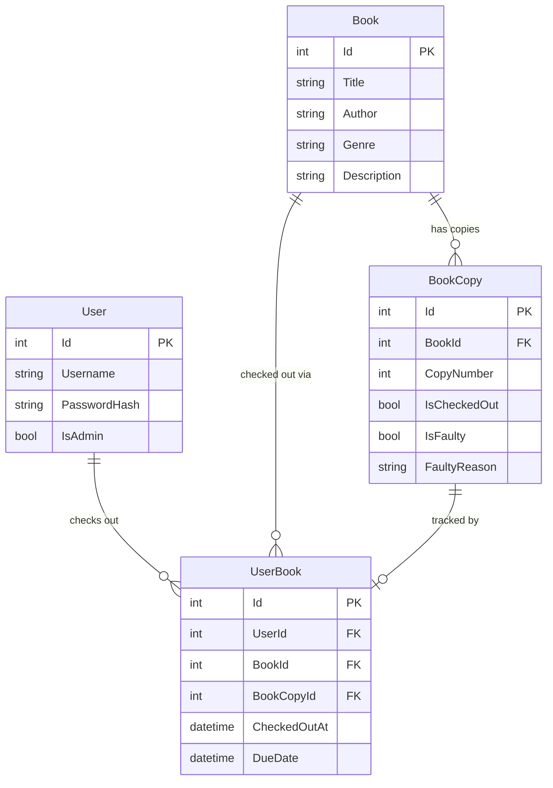

```mermaid
erDiagram
    User {
        int Id PK
        string Username
        string PasswordHash
        bool IsAdmin
    }

    Book {
        int Id PK
        string Title
        string Author
        string Genre
        string Description
    }

    BookCopy {
        int Id PK
        int BookId FK
        int CopyNumber
        bool IsCheckedOut
        bool IsFaulty
        string FaultyReason
    }

    UserBook {
        int Id PK
        int UserId FK
        int BookId FK
        int BookCopyId FK
        datetime CheckedOutAt
        datetime DueDate
    }

    User ||--o{ UserBook : "checks out"
    Book ||--o{ BookCopy : "has copies"
    Book ||--o{ UserBook : "checked out via"
    BookCopy ||--o| UserBook : "tracked by"
```
